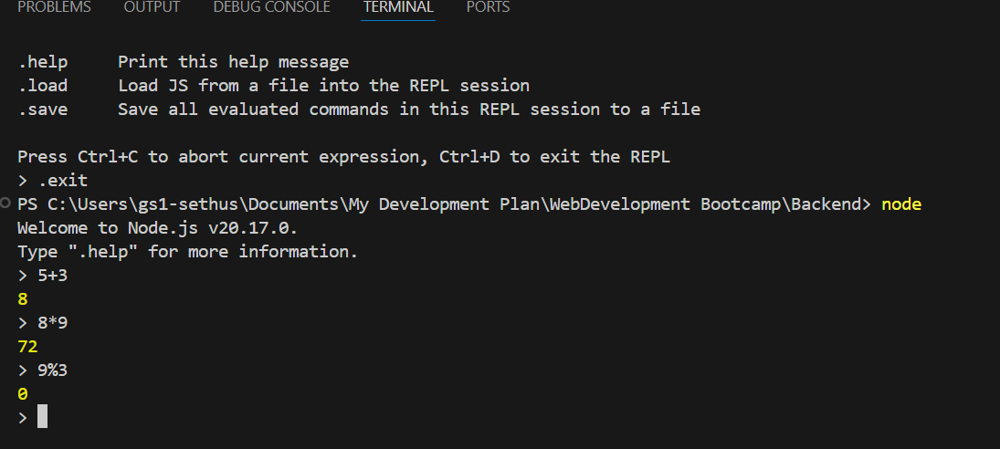
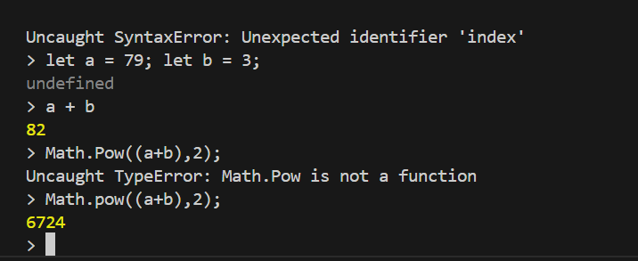
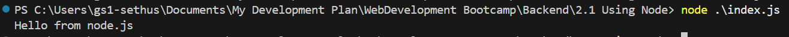

Node.js => a Javascript framework which provides pre built components and structures which enables to build
the web application fast.
So node.js is a asynchronous event driven javascript runtime and is designed to build scalable network
applications.

Node uses the v8 engine and allowed to use javascript to write any sort of application from desktop to 
server-side. Backend applications can be written using javascript with the help of node.

Asynchronus process means that the code wont run in a sequential way. It can be able to do multiple actions.
asynchronous code runs only when there is any event triggered. 

Node REPL(Read Evaluate Print Loop) => is a computer environment where the user input are read, evaluated
and the results are returned to the user. use node in the terminal to enter the repl. It can also evaluate javascript.

Node repl is similar to the javascript console in the browser.

We can run javascript files using node.

Native node modules can be included into the application to perform various tasks. These incluse File System, Debugger, Errors etc., To use native node modules in the application, we can either import the module or use require()