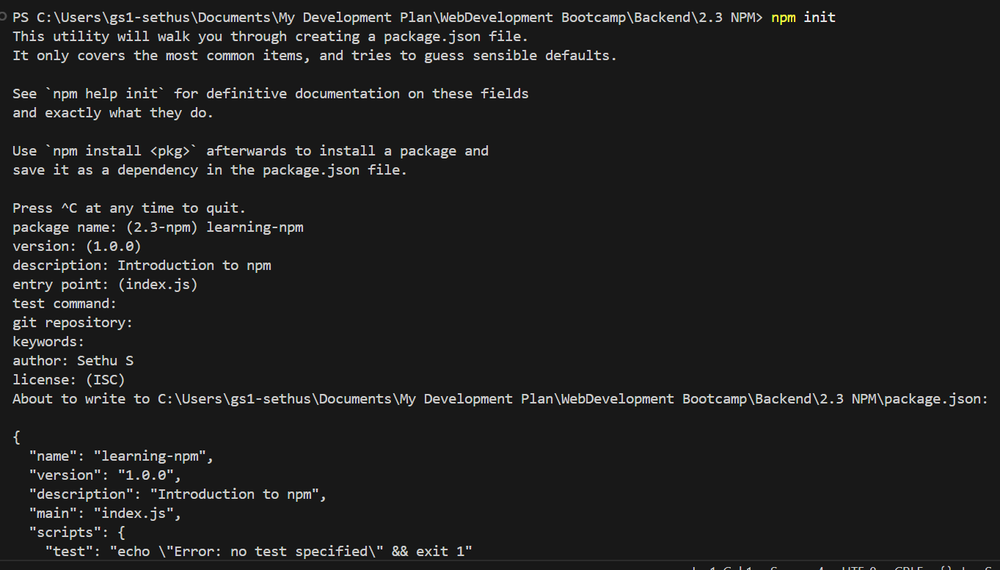
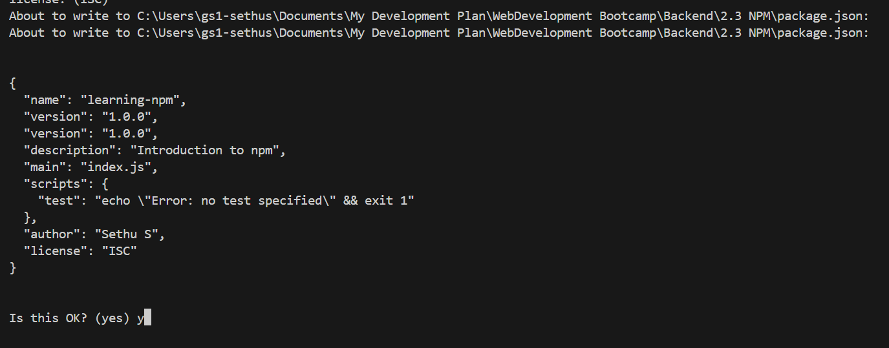

Node Package Manager(NPM) is used to get access to all the open source node packages in the world. NPM is a place where modules built for node and it is collected and managed by github.

When node is installed, npm also comes installed with it.

npm init - command to initialize npm.

npm install <package_name> - to install node packages. 
To install multiple packages npm install <package1_name> <pacakge2_name> <package3_name> ...

After performing npm install the node_modules folder is created with the installed dependencies and the package-lock.json file isgenerated with the specified dependency. These dependencies provide various functionalities that can be leveraged and used in our application.

When importing a package from npm use "import name from package_name;" and also specify type:"module" in
package.json to use Ecmascrpit Modules.